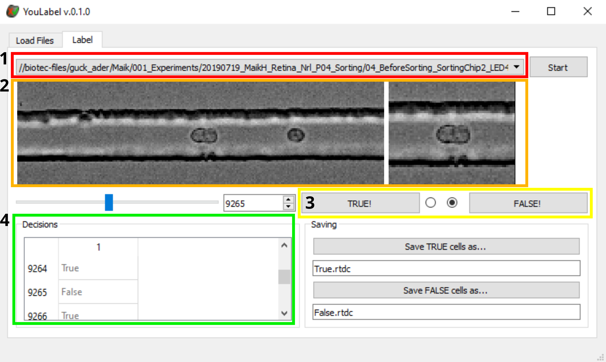

# YouLabel
GUI based software to view and label images of RT-DC datasets

# Screenshot
  
Colored rectangles in the image indicate the workflow
1. (Red rectangle) select dataset that should be worked on. After selection the file is loaded and the images of the dataset are displayed.
2. (Orange rectangle) images of the loaded dataset are displayed. In RT-FDC datasets, the midpoint of each tracked object is stored. Based on this midpoint, the full image (left) is cropped (right) to show the tracked object in the center. To display the next or the previous image, the right and left arrow key can be used.    
3. (Yellow rectangle) buttons to indicate if the displayed image corresponds to class 1 (True) or class 2 (False). Alternatively, the keyboard shortcuts “T” and “F” may be used.   
4. (Green rectangle) list shows the labelling decisions. By default, all events are labelled “True”.  
 
# Installation
YouLabel comes as a standalone executable contained in a zip file. You basically just need to download the .zip and unzip. The followin 5 steps explain how this is done:    
* Go to https://github.com/maikherbig/YouLabel/releases
* Download a zip-file (this file contains the **_standalone executable_**)   
* Unzip it  
* Go into the unzipped folder and scroll down until you find an executable (full name is for example "YouLabel_0.0.1.exe")  
* DoubleClick this .exe to run it (no further installation is required)  
